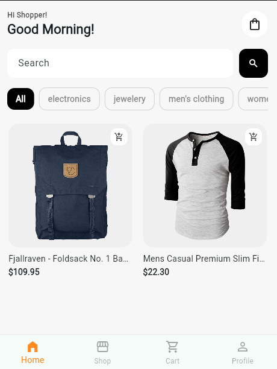
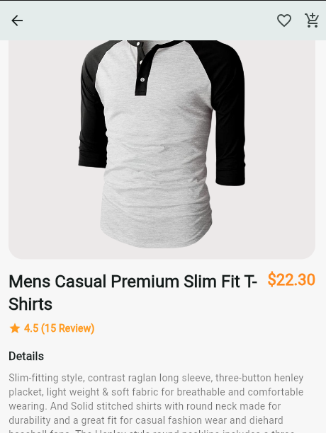

<a name="readme-top"></a>

# 📗 Table of Contents

- [📖 About the Project](#about-project)
  - [🛠 Built With](#built-with)
    - [Tech Stack](#tech-stack)
    - [Key Features](#key-features)
  - [🚀 Live Demo](#live-demo)
- [💻 Getting Started](#getting-started)
  - [Prerequisites](#prerequisites)
  - [Setup](#setup)
  - [Install](#install)
  - [Usage](#usage)
  - [Architecture](#architecture)
  - [Patterns](#patterns)
  - [Project Structure](#project-structure)
  - [Run tests](#run-tests)
  - [Deployment](#deployment)
- [👥 Authors](#authors)
- [🔭 Future Features](#future-features)
- [🤝 Contributing](#contributing)
- [⭐️ Show your support](#support)
- [🙏 Acknowledgements](#acknowledgements)
- [❓ FAQ (OPTIONAL)](#faq)
- [📝 License](#license)


<!-- PROJECT DESCRIPTION -->

# 📖 FakeStore Shop

> A Flutter e-commerce app built with Riverpod, featuring product listing, filters, search, pagination, offline-aware caching, cart persistence, and robust error handling.

## About the Project
FakeStore Shop is a mobile shopping app powered by the FakeStore API.  
It focuses on clean state management, resilient data loading, cache safety, and a polished user experience.

## 🛠 Built With <a name="built-with"></a>

- [ ] Flutter
- [ ] Dart
- [ ] Riverpod
- [ ] Dio
- [ ] Hive
- [ ] connectivity_plus
- [ ] Equatable
- [ ] Flutter Test
- [ ] Mocktail


### Key Features <a name="key-features"></a>

- Product listing with infinite scroll pagination
- Search by product name
- Category filtering
- Combined search + category filtering
- Product detail page with add-to-cart
- Persistent cart using local storage
- Offline-aware cache read strategy
- Stale-while-revalidate product cache
- Error handling for:
  - 500 server errors
  - slow network/timeouts
  - corrupted cached data
  - malformed API data
  - image loading failures
- Widget, state, and repository test coverage

> Describe between 1-3 key features of the application.

- **Offline-first browsing (cache-first + stale-while-revalidate) The app loads products from a local Hive cache first so screens open instantly and still work without internet. When the device is online and cached data is stale, it refreshes silently in the background to keep data up to date.**
- **Client-side pagination (“Load more”) Products are fetched once (from cache or network) and then paginated locally into pages (e.g., 10 items per page). This keeps scrolling fast and avoids extra API calls just to see more items.**
- **Smart networking to prevent unnecessary calls Requests are de-duplicated (multiple widgets asking for the same data triggers only one network call) and controlled with TTL freshness checks. This reduces bandwidth usage, improves performance, and makes the app more stable under poor networks.**


## Architecture
This project follows a well-layered, feature-based architecture:
- `data`: API + repository + caching
- `domain`: entities + failure models
- `state`: notifier/providers
- `presentation`: pages + widgets

<p align="right">(<a href="#patterns">back to top</a>)</p>
Patterns used:
- Repository pattern
- Dependency injection via Riverpod providers
- Separation of concerns across data/domain/presentation

<p align="right">(<a href="#readme-top">back to top</a>)</p>

## Project Structure
```bash
lib/
  core/
    cache/
    network/
  features/
    cart/
      presentation/
      state/
    products/
      data/
      domain/
      presentation/
      state/
test/
  cart_notifier_test.dart
  paginator_test.dart
  product_page_test.dart
  product_repository_test.dart
  widget_test.dart
```


<!-- LIVE DEMO -->

## 🚀 Live Demo <a name="live-demo"></a>

> Add a link to your deployed project.

- [Live Demo Link](https://google.com)

<p align="right">(<a href="#readme-top">back to top</a>)</p>

## 💻 Getting Started <a name="getting-started"></a>

> Describe how a new developer could make use of your project.

To get a local copy up and running, follow these steps.


### Prerequisites
In order to run this project you need:

- Flutter SDK `>=3.x`
- Dart SDK (bundled with Flutter)
- Android Studio or VS Code
- Device emulator/simulator or physical device


```sh
 git clone https://github.com/addod19/e-commerce/fakestoore_shop.git
 cd fakestore_shop
 flutter pub get
```


### Setup

Clone this repository to your desired folder:

```bash
 git clone https://github.com/addod19/e-commerce/fakestoore_shop.git
 cd fakestore_shop
 flutter pub get
```

### Install

Install this project with:

```sh
  cd fakestore_shop
  flutter pub get
```


### Usage

To run the project, execute the following command:

```sh
  flutter run
```

To run on a specific device
```bash
flutter devices
flutter run -d <device_id>
```

### Run tests

To run tests, run the following command:

```sh
  flutter test
```

To run static analysis
```bash
flutter analyze
```
### Deployment

You can deploy this project using:

```sh
  Not yet deployed
```

## Screenshots

 
  

<p align="right">(<a href="#readme-top">back to top</a>)</p>

<!-- AUTHORS -->

## 👥 Authors <a name="authors"></a>

> Mention all of the collaborators of this project.

👤 **Daniel Larbi Addo**

- GitHub: [@githubhandle](https://github.com/addod19)
- Twitter: [@twitterhandle]([https://twitter.com/daniellarbiaddo](https://x.com/DanielLarbiAdd1))
- LinkedIn: [LinkedIn](https://linkedin.com/in/daniel-larbi-addo)

<p align="right">(<a href="#readme-top">back to top</a>)</p>

<!-- FUTURE FEATURES -->

## 🔭 Future Features <a name="future-features"></a>

> Describe 1 - 3 features you will add to the project.

- [ ] **Add favorites/wishlist persistence**
- [ ] **Add checkout flow**
- [ ] **Add authentication**
- [ ] **Improve accessibility and localization**
- [ ] **Add CI pipeline for test/analyze/lint checks**


<p align="right">(<a href="#readme-top">back to top</a>)</p>

<!-- CONTRIBUTING -->

## 🤝 Contributing <a name="contributing"></a>

Contributions, issues, and feature requests are welcome!

Feel free to check the [issues page](../../issues/).

#### Contributions are welcome.

- [ ] Fork the repository
- [ ] Create a feature branch: git checkout -b feature/your-feature
- [ ] Commit changes: git commit -m "feat: add your feature"
- [ ] Push branch: git push origin feature/your-feature
- [ ] Open a Pull Request

<p align="right">(<a href="#readme-top">back to top</a>)</p>

<!-- SUPPORT -->

## ⭐️ Show your support <a name="support"></a>

> Write a message to encourage readers to support your project

If you like this project, kindly star the project

<p align="right">(<a href="#readme-top">back to top</a>)</p>

<!-- ACKNOWLEDGEMENTS -->

## 🙏 Acknowledgments <a name="acknowledgements"></a>

> Give credit to everyone who inspired your codebase.

- [ ] FakeStore API
- [ ] Flutter and Riverpod communities
- [ ] Teczaleel for giving me this opportunity to show my skills and also improve my developer experience

<p align="right">(<a href="#readme-top">back to top</a>)</p>


<!-- LICENSE -->

## 📝 License <a name="license"></a>

This project is [MIT](./LICENSE) licensed.

_NOTE: we recommend using the [MIT license](https://choosealicense.com/licenses/mit/) - you can set it up quickly by [using templates available on GitHub](https://docs.github.com/en/communities/setting-up-your-project-for-healthy-contributions/adding-a-license-to-a-repository). You can also use [any other license](https://choosealicense.com/licenses/) if you wish._

<p align="r